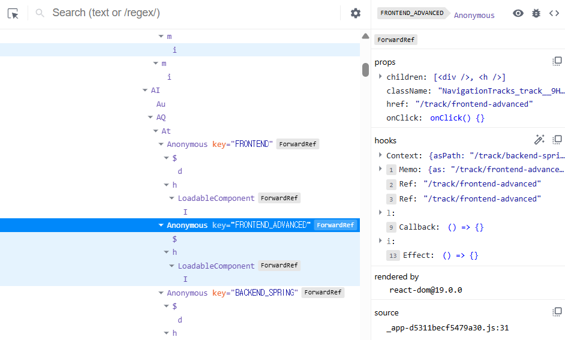

# 렌더링 구조

## virtual dom과 real dom
html이 다음과 같이 작성되어 있습니다.
```html
<div id="app">
  <h1>Hello, world!</h1>
  <p>Welcome to my site.</p>
</div>
```


### real dom
브라우저가 웹 페이지를 렌더링하기 위해 사용하는 실제 문서 객체 모델. HTML 요소를 트리 형태로 구조화한 것
```js
const APP = document.getElementById("app")
APP.innerHTML
APP.children
APP.textContent
```
- 요소는 HTMLElement 클래스의 인스턴스
- innerHTML, children, textContent 등 속성을 가짐

### virtual dom
실제 DOM의 복사본. JavaScript 객체로 구성되며, 실제 화면에는 없고 메모리에서만 존재
```js
const vdom = {
  type: 'div',
  props: {
    id: 'app',
    children: [
      {
        type: 'h1',
        props: {
          children: 'Hello, world!'
        }
      },
      {
        type: 'p',
        props: {
          children: 'Welcome to my site.'
        }
      }
    ]
  }
};
```
- createElement 또는 JSX 파싱 후 형태
- type은 태그명(div,h1,p,)
- props는 속성과 자식 요소

### virtual dom과 real dom의 차이점
속도와 성능
- real DOM
  - 직접 조작 시 비용이 크고 느리며, 한 번 수정할 때 마다 브라우저가 전체 UI를 다시 렌더링
- virtual DOM
  - 변경 사항을 메모리상에서 처리 -> 변경 전과 후의 차이를 계산(diffing) -> 필요한 부분만 실제 DOM에 적용(patching)

업데이트 방식
- real DOM
  - 변경이 일어날 때마다 직접 업데이트 -> 리렌더링이 많이 발생하면 렌더링 비용 상승
- virtual DOM
  - 여러 변경사항을 한 번에 모아 배치 처리 -> 효율적인 렌더링

## Fiber
- React 16부터 도입된 새로운 Reconciliation(조정) 알고리즘
- virtual dom의 변화 -> 실제 DOM 반영 사이의 과정을 더 정교하게 처리하기 위한 구조

### Fiber의 구조
- fiber는 js 객체이며 트리 형태로 구성됨
- 각 fiber 노드는 react component 임

```js
{
  type: 'div',
  key: null,
  child: FiberNode,
  sibling: FiberNode,
  return: FiberNode, // 부모
  stateNode: DOM element or Component instance,
  pendingProps: {...},
  memoizedProps: {...},
  alternate: FiberNode (이전 상태와 비교용)
  ...
}
```
- react element 하나 당 fiber 노드 하나가 생기며, 이 노드들로 fiber트리를 구성합니다.

### 콜스택 대신 파이버 트리 사용하는 이유 장단점
- 콜스택 기반 재귀 렌더링
  - 깊은 트리 구조일수록 브라우저가 UI 쓰레드를 오래 점유해, 렌더링 중 사용자 인터랙션이 끊김
  - 긴 렌더링 -> 중단 불가 -> 렌더링 중단 -> UX 좋지 않음

- 파이버 트리 순회 기반의 단위 작업
  - 파이버는 렌더링 단위를 작업 단위로 쪼개서 처리
  - 시간이 오래 걸릴 경우 중단 가능 -> 브라우저에게 제어권을 넘김 -> 나중에 다시 재개
  - 렌더링이 비동기적/ 점진적/ 우선순위 기반으로 이루어짐

**장점**
- 렌더링 중단/재개 가능
- 우선순위 처리
- 효율적인 메모리 관리
- Suspense, Concureent mode 같은 고급 기능 가능

**단점**
- 구조가 복잡
- 디버깅 난이도가 높음
- 러닝 커브 존재

### react devtools에 fiber트리 형태

## reconcilication
**컴포넌트의 상태나 props가 바뀌었을 때**,
기존의 vdom과 새로운 vdom을 비교해서 **실제로 변경된 부분만**
실제 dom에 반영하는 것

### 리렌더링을 피하는 경우
1. props 또는 state가 변하지 않는경우
```js
const [count, setCount] = useState(0);
//위의 상태를 가질 때 setCount(0)한 경우 리렌더링 X
```

2. memo를 사용하고 props가 변경되지 않는 경우 리렌더링을 건너뜀
- memo로 최적화하는 것은 컴포넌트가 정확히 동일한 Props로 자주 리렌더링 되고, 리렌더링 로직이 비용이 많이 드는 경우에만 유용합니다.

```js
import { memo, useState } from 'react';

export default function MyApp() {
  const [name, setName] = useState('');
  const [address, setAddress] = useState('');
  return (
    <>
      <label>
        Name{': '}
        <input value={name} onChange={e => setName(e.target.value)} />
      </label>
      <label>
        Address{': '}
        <input value={address} onChange={e => setAddress(e.target.value)} />
      </label>
      <Greeting name={name} />
    </>
  );
}

const Greeting = memo(function Greeting({ name }) {
  console.log("Greeting was rendered at", new Date().toLocaleTimeString());
  return <h3>Hello{name && ', '}{name}!</h3>;
});
```

- 부모컴포넌트 MyApp, 자식 컴포넌트 Greeting
- 자식 컴포넌트는 name을 props로 받고 있음
- 부모에서 name이 변경된 경우 자식도 리렌더링이지만, address가 변경된 경우 리렌더링 x

3. key를 기준으로 요소를 추적하고 재사용, 변경이 일어난 부분만 리렌더링
```js
const items = ['a', 'b', 'c'];
return items.map((item) => <li key={item}>{item}</li>);
```

## ReactNode, JSX & ReactElement

### ReactNode
react가 렌더링 할 수 있는 모든것, 
외부에서 주입을 받을 컴포넌트 타입 정의할 때 많이 사용
```ts
type ReactNode =
  | ReactElement
  | string
  | number
  | ReactFragment
  | ReactPortal
  | boolean
  | null
  | undefined

type ReactFragment = Iterable<ReactNode>

const node1 = <div>Hello</div>;       // React Element
const node2 = "Hello";                // string
const node3 = 123;                    // number
const node4 = null;                   // null
const node5 = [<p>1</p>, <p>2</p>];   // array of elements
```

### ReactElement와 JSX
JSX는 ReactElement를 생성하기 위한 문법이고 ReactElement은 Babel이 React.createElement 호출로 컴파일한 결과의 객체입니다.

두 예시는 동일합니다.
```js
const element = (
  <h1 className="greeting">
    Hello, world!
  </h1>
);
```

```js
const element = React.createElement(
  'h1',
  {className: 'greeting'},
  'Hello, world!'
);
```

생성된 객체의 구조는 다음과 같습니다.
```js
const element = {
  type: 'h1',
  props: {
    className: 'greeting',
    children: 'Hello, world!'
  }
};
```


## 리렌더링 최적화 전략
리렌더링은 3가지의 경우 발생합니다.
- 상태변경
- props 변경
- 부모 컴포넌트가 리렌더링 -> 자식 컴포넌트도 리렌더링 (props변화가 없어도)

### memo, useCallback, useMemo, key의 원리

**memo**
컴포넌트 메모이제이션
- props가 변경되지 않으면 리렌더링 하지 않도록 막아줌
```js
const Component = memo(({ name }) => {
  console.log("Child render");
  return <div>{name}</div>;
});
```

**useCallback**
함수 메모이제이션
- 리렌더링될 때마다 함수는 새로 만들어지는데, 그걸 방지해서 **같은 함수 인스턴스**를 유지하고 싶을 때 사용
```js
const handleClick = useCallback(() => {
  console.log("clicked");
}, []);
```
👉 주로 자식 컴포넌트에 함수를 props로 넘길 때 memo와 함께 사용

**useMemo**
값 계산 결과 메모이제이션
- 비싼 계산(무거운 연산, 반복문 등)을 다시 하지 않고, 이전 값을 재사용
- 리렌더링될 때마다 계산이 반복되는 걸 방지
```js
const expensiveValue = useMemo(() => {
  return heavyCalculation(input);
}, [input]);
```

**key**
React에서 리스트 렌더링할 때 각 항목을 구분하기 위한 고유 식별자
```jsx
{items.map(item => (
  <li key={item.id}>{item.name}</li>
))}
```
- key는 **변경 감지(diffing 알고리즘)**에 사용됨
- 잘못된 key (ex. index 사용)는 불필요한 리렌더링이나 렌더 순서 문제를 유발할 수 있음
